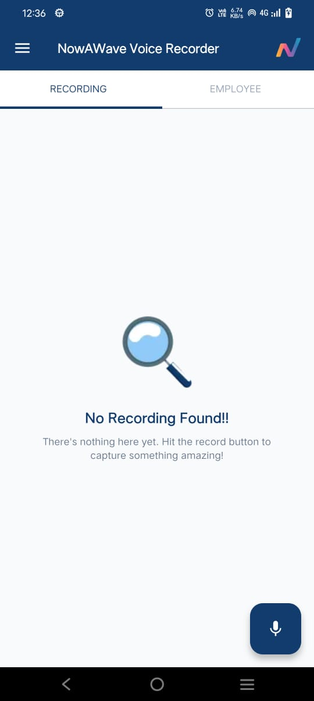
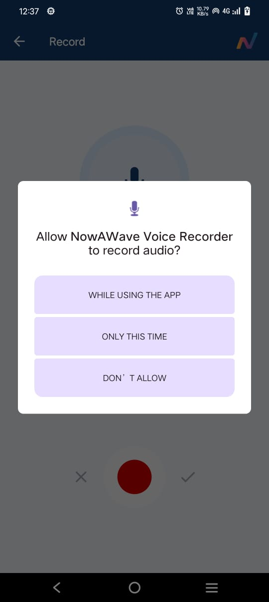
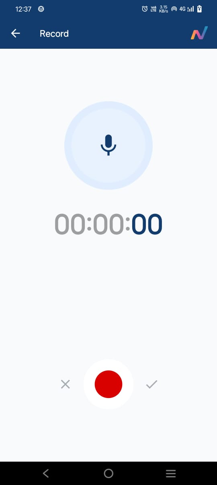
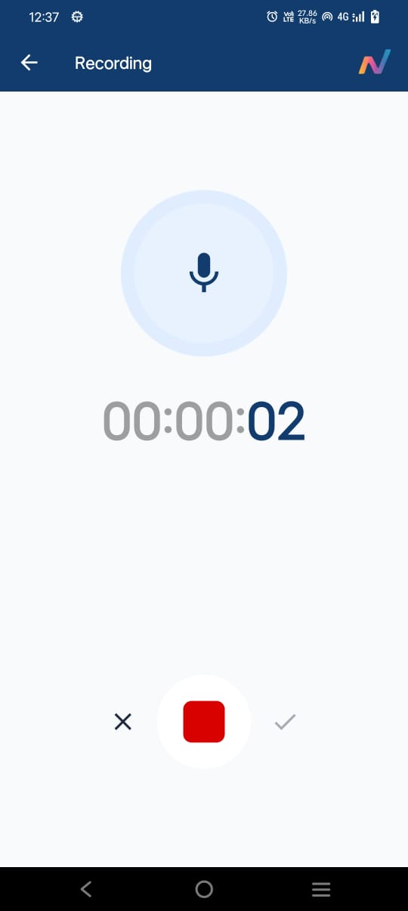
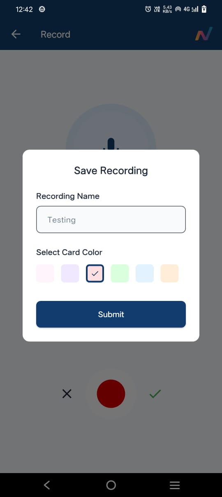
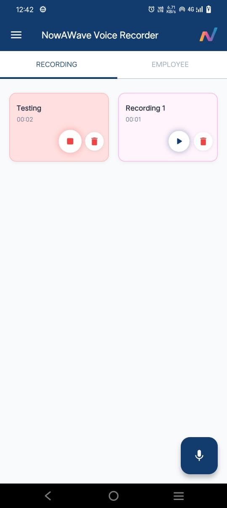
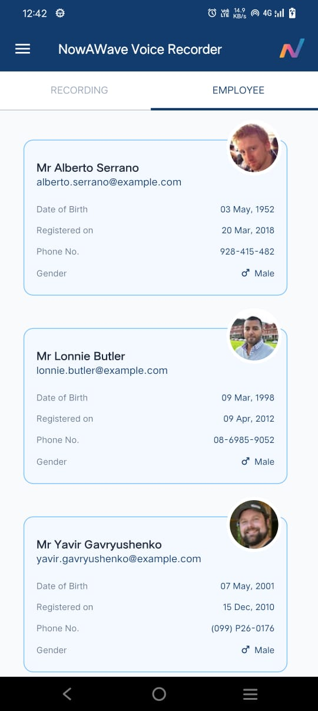

# 🎙️ NowAWave Voice Recorder App - Flutter Interview Task

A professional Flutter application featuring audio recording functionality and employee data management, built for NowAWave Pvt. Ltd. technical interview.

---

## 📱 App Overview & Demo

### 📸 Screenshots

|           Recording Tab - Empty          |                   Permission Screen                  |                  Recording Screen 1                  |
| :--------------------------------------: | :--------------------------------------------------: | :--------------------------------------------------: |
|  |  |  |

|                  Recording Screen 2                  |            Save Recording Dialog            |                 Recording Grid                 |
| :--------------------------------------------------: | :-----------------------------------------: | :--------------------------------------------: |
|  |  |  |

|                 Employee List                |
| :------------------------------------------: |
|  |

### 📱 Download APK

[](https://drive.google.com/file/d/1R9kdHWgF_75-1of2OaDflG3ryuWwZJL3/view?usp=drive_link)

---

## ✨ Features

### 🎵 Recording Tab

* High-quality audio recording with real-time timer.
* Color-coded recording cards (6 custom colors).
* Play/Stop functionality with smooth animations.
* Persistent local storage using SharedPreferences.
* Pixel-perfect, intuitive UI matching Figma specifications.

### 👥 Employee Tab

* Fetches employee data from `https://randomuser.me/api/?results=20`.
* Smooth pagination and efficient scrolling.
* Comprehensive error handling and feedback.
* Clean and professional list display with employee details.

---

## 🛠 Technical Implementation

### Architecture

* Clean Architecture with proper separation of concerns.
* BLoC pattern for state management.
* Repository pattern for data abstraction.
* Dependency injection using GetIt.

### Dependencies

```yaml
dependencies:
  flutter:
    sdk: flutter
  flutter_bloc: ^8.1.3
  dio: ^5.4.0
  shared_preferences: ^2.2.2
  equatable: ^2.0.5
  intl: ^0.18.1
  uuid: ^4.2.1
  get_it: ^7.6.4
  permission_handler: ^11.0.1
  record: ^4.4.0
  path_provider: ^2.1.1
  audioplayers: ^5.2.1
  cupertino_icons: ^1.0.8

dev_dependencies:
  flutter_test:
    sdk: flutter
  flutter_lints: ^5.0.0
```

---

## 🚀 Installation & Setup

### Prerequisites

* Flutter SDK (3.9.0 or higher)
* Android Studio / VS Code
* Android/iOS device or emulator

### Steps to Run

1. **Clone the repository**

```bash
git clone https://github.com/Trilok1110/project_recorder_app.git
cd recorder_app
```

2. **Install dependencies**

```bash
flutter pub get
```

3. **Run the application**

```bash
flutter run
```

### Platform-Specific Setup

#### Android

Minimum SDK: 21
Add permissions in `android/app/src/main/AndroidManifest.xml`:

```xml
<uses-permission android:name="android.permission.RECORD_AUDIO" />
<uses-permission android:name="android.permission.WRITE_EXTERNAL_STORAGE" />
<uses-permission android:name="android.permission.READ_EXTERNAL_STORAGE" />
<uses-permission android:name="android.permission.MANAGE_EXTERNAL_STORAGE" />
```

---

## 📁 Project Structure

```
lib/
├── core/
│   ├── constants/
│   │   └── app_colors.dart
│   ├── theme/
│   │   └── app_theme.dart
│   ├── network/
│   │   └── api_client.dart
│   └── usecases/
│       └── usecase.dart
├── features/
│   ├── recording/
│   │   ├── data/
│   │   │   ├── datasources/
│   │   │   │   └── recording_local_data_source.dart
│   │   │   ├── models/
│   │   │   │   └── recording_model.dart
│   │   │   └── repositories/
│   │   │       └── recording_repository_impl.dart
│   │   ├── domain/
│   │   │   ├── entities/
│   │   │   │   └── recording_entity.dart
│   │   │   ├── repositories/
│   │   │   │   └── recording_repository.dart
│   │   │   ├── usecases/
│   │   │   │   ├── get_recordings.dart
│   │   │   │   ├── save_recording.dart
│   │   │   │   └── delete_recording.dart
│   │   │   └── services/
│   │   │       └── audio_player_service.dart
│   │   └── presentation/
│   │       ├── bloc/
│   │       │   ├── recording_bloc.dart
│   │       │   ├── recording_event.dart
│   │       │   └── recording_state.dart
│   │       ├── pages/
│   │       │   ├── recording_page.dart
│   │       │   └── recording_screen.dart
│   │       └── widgets/
│   │           ├── recording_card.dart
│   │           ├── recording_grid_view.dart
│   │           ├── empty_recording_state.dart
│   │           └── save_recording_dialog.dart
│   └── employee/
│       ├── data/
│       │   ├── datasources/
│       │   │   └── employee_remote_data_source.dart
│       │   ├── models/
│       │   │   └── employee_model.dart
│       │   └── repositories/
│       │       └── employee_repository_impl.dart
│       ├── domain/
│       │   ├── entities/
│       │   │   └── employee_entity.dart
│       │   ├── repositories/
│       │   │   └── employee_repository.dart
│       │   └── usecases/
│       │       └── get_employees.dart
│       └── presentation/
│           ├── bloc/
│           │   ├── employee_bloc.dart
│           │   ├── employee_event.dart
│           │   └── employee_state.dart
│           ├── pages/
│           │   └── employee_page.dart
│           └── widgets/
│               └── employee_card.dart
├── injection_container.dart
└── main.dart
```

---

## 🎯 Implementation Details

### Recording Feature

* `RecordingEntity`: id, title, color, filePath, duration, date.
* Persistent local storage with JSON serialization.
* Audio recording using `record` package.
* BLoC events for load, add, delete, play, stop.

### Employee Feature

* REST API integration using Dio.
* Smooth scrolling and pagination.
* Professional list display with employee details.

### UI/UX Features

* Responsive and adaptive layouts.
* Smooth animations and transitions.
* Proper contrast and accessibility.
* User-friendly error messages and loading states.

---

## 🎨 Design Compliance

* Exact color palette and typography as per Figma.
* Pixel-perfect spacing and sizing.
* Consistent iconography and visual hierarchy.
* Smooth user flows as specified in requirements.

---

## 📝 API Documentation

### Employee API

* **Endpoint**: `https://randomuser.me/api/?results=20`
* **Method**: GET
* **Response**: JSON with employee data including name, email, phone, and picture.

---

## 🐛 Troubleshooting

### Common Issues

1. Audio recording fails: Check microphone permissions.
2. File not found: Verify Android storage permissions.
3. API errors: Check internet connection and endpoint.

### 🐞 Debug Mode

Use the custom `logger` function for debug messages. All logs appear only in debug mode and are suppressed in release builds.

```dart
import 'package:flutter/foundation.dart';

/// Custom logger for debugging
void logger(String message) {
  if (kDebugMode) {
    debugPrint('[DEBUG] $message');
  }
}

---

## 📄 License & Confidentiality

**Confidential**: Proprietary to NowAWave Pvt. Ltd. Do not share or reuse without explicit permission.

---

## 👨‍💻 Developer

Built with ❤️ using Flutter for NowAWave Pvt. Ltd. technical interview.

